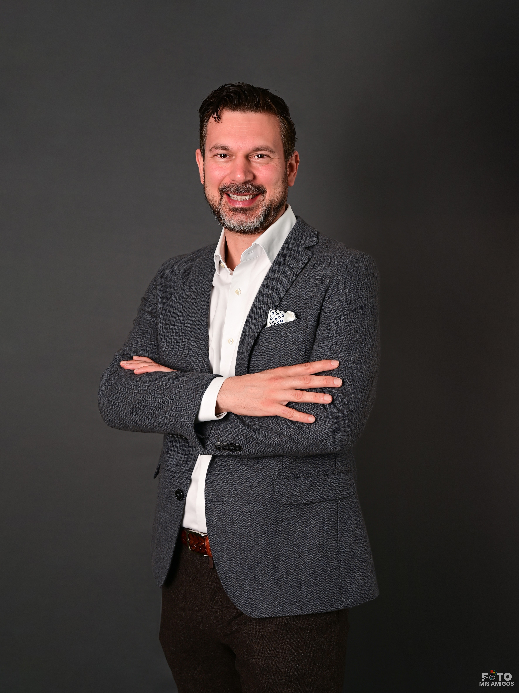

# Giuseppe Danese, Ph.D.

**Researcher**  
Department of Economics and Management “Marco Fanno”  
University of Padua (Italy)

---

I am a researcher in management and sustainability, with a focus on how firms adapt to climate change and how behavioral change can support more sustainable economic outcomes.

I received a Ph.D. in Economics from **Simon Fraser University (Canada)**.  
Before joining the University of Padua, I served as a **Lecturer** in the *Philosophy, Politics & Economics* program at the **University of Pennsylvania** and as a **Postdoctoral Researcher** at **Católica Porto Business School**.

---

## Research Focus

My work lies at the intersection of sustainability strategy, organizational adaptation, and behavioral economics, with particular attention to small and medium-sized enterprises.

**Core interests**
- Sustainability and climate strategy  
- SME adaptation and organizational change  
- Hybrid organizations and social innovation  

---

## Current Projects

- Climate adaptation and mitigation strategies in Italian SMEs  
- Energy communities and hybrid forms of organizing  

---

## Contacts

📧 **giuseppe.danese@unipd.it**  

🎥 **Zoom room:** https://unipd.zoom.us/my/gdanese  

📅 **Book an appointment:** https://calendar.app.google/dhsB7AfT94KnYdEY8  

☎️ **Office phone:** +39 049 827 4055  

---
## Institutional Address

Department of Economics & Management “Marco Fanno”  
University of Padua  
Via del Santo, 33  
35123 Padova (Italy)

---

## Profiles

- [Google Scholar](https://scholar.google.com/citations?user=nsugQFcAAAAJ&hl=en&oi=ao)

---

## Writing

- [Blog — *Climate Change Adaptation for Business*](https://ccadapt4biz.wordpress.com)
